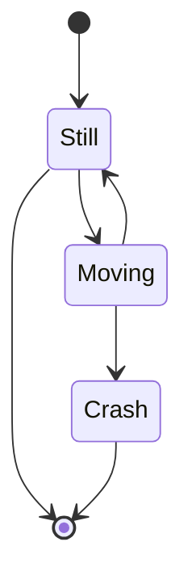
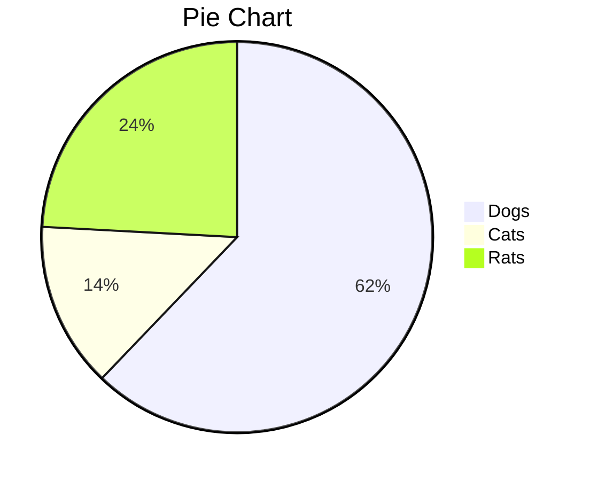

# Introduction to


<br>
Wei Min Cher

09 January 2020


---

<!-- paginate: true -->
<!-- footer: IAP 2020: Introduction to Markdown and MkDocs -->

# Contents

- Markdown
- GitHub Flavored Markdown
- Typora
- Pandoc
- Mkdocs

---


# Markdown

- Lightweight markup language
- Can be converted to many formats

---


# GitHub Flavored Markdown

---

# Markdown Editor

- GitHub Gist
- Stackedit.io

---

# Headers

<br>

`# This is an h1 tag`
`## This is an h2 tag`
`###### This is an h6 tag`

---

# This is an h1 tag

## This is an h2 tag

###### This is an h6 tag

---

# Emphasis

<br>

`*This will be italic*` `_This will also be italic_`

`**This will be bold**` `__This will also be bold__`
<br>
`_You **can** combine them_`

---

_This will be italic_ _This will also be italic_
**This will be bold** **This will also be bold**
_You **can** combine them_

---

# Unordered Lists

```text
* Item 1
* Item 2
  * Item 2a
  * Item 2b
```

---

- Item 1
- Item 2
  - Item 2a
  - Item 2b

---

## Ordered Lists

```text
1. Item 1
2. Item 2
3. Item 3
  i. Item 3a
  ii. Item 3b
```

---

1. Item 1
2. Item 2
3. Item 3
   i. item 3a
   ii. item 3b

---

# Links

<br>

`http://github.com`
`[GitHub](http://github.com)`

---

http://github.com
[GitHub](http://github.com)

---

# Images

<br>

``

---


---

# Tables

```text
First Header | Second Header
------------ | -------------
Content from cell 1 | Content from cell 2
Content in the first column | Content in the second column
```

---


---

# Activity 1 (10 mins)

- Make a to-do list with 3 categories
  1. To do
  2. In progress
  3. Done

---

```text
#### To do

1. Pray for good fortune

- Temple
- Bell curve god

##### In progress

1. Catching up on **_SLEEP_**

###### Done

1. School
```

---

#### To do

1. Pray for good fortune

- Temple
- Bell curve god

##### In progress

1. Catching up on **_SLEEP_**

###### Done

1. School

---

# Inline code

```text
I think you should use an `<addr>` element here instead.
```

---

I think you should use an `<addr>` element here instead.

---

# Syntax highlighting

````
```javascript
function fancyAlert(arg) {
  if(arg) {
    $.facebox({div:'#foo'})
  }
}
````

````
```python
def foo():
    if not bar:
        return True
```
````

---

# Blockquotes

<br>

```text
As Kanye West said:

> We're living the future so the present is our past.
```

---


---


# Works with HTML.

---


# Typora

http://typora.io/

---

# Inline Math

<br>

```text
The identity matrix is $\left[\begin{array}{cc}
1 & 0\\0 & 1\end{array}\right]$.

$$ e = mc^2$$

```

---

The identity matrix is $\left[\begin{array}{cc}1 & 0\\0 & 1\end{array}\right]$.

$$ e = mc^2$$

---

## Introduction to $LaTeX$

20 January 2020 (Monday)
TT16 (2.201)
7 - 10 pm
<br>
Sign up [here](https://docs.google.com/forms/d/e/1FAIpQLScYzcq2nsw-QWtsPPeN9J_t96SjpuSPPCvh4IDOBchfeol5UQ/viewform).

---

# Diagrams

---

# UML Sequence

#### `js-sequence`

<br>

````text
```sequence
Alice->Bob: Hello Bob, how are you?
Note right of Bob: Bob thinks
Bob-->Alice: I am good thanks!

​```

````

---


---

# Flowchart

#### `flowchart.js`

````text
```flow
st=>start: Start
op=>operation: Your Operation
cond=>condition: Yes or No?
e=>end

st->op->cond
cond(yes)->e
cond(no)->op
​```
````

---


---


# Mermaid

#### `mermaid-js`

---

# Class Diagram

<br>

````text
```mermaid
classDiagram
      Animal <|-- Duck
      Animal <|-- Fish
      Animal <|-- Zebra
      Animal : +int age
      Animal : +String gender
      Animal: +isMammal()
      Animal: +mate()
````

---

```text
      class Duck{
          +String beakColor
          +swim()
          +quack()
      }
      class Fish{
          -int sizeInFeet
          -canEat()
      }
      class Zebra{
          +bool is_wild
          +run()
      }
```

---

## 

---

# State Diagram

<br>

````text

````

---

## 

---

# Pie Chart

<br>

````text

````

---

## 

---

# Pandoc

Swiss-army knife to convert content

---

# Conversion between

- PDF
- Markup formats
- HTML formats
- Ebooks
- XML formats
- $TeX$ formats
- Word processor formats
- Interactive notebook formats
  $\cdots$

---

# Demo

Converting Markdown to PDF

---

# MkDocs

Project documentation with Markdown.

---

# Installing MkDocs

<br>

```python
pip install mkdocs
```

---

# Material theme for MkDocs

<br>

```python
pip install mkdocs-material
```

---

# Create a new site

- `cd` to the appropriate folder

```sh
mkdocs new my-project
cd my-project
```

---

# Editing `mkdocs.yml`

<br>

```yml
site_name: Test
nav:
  - Home: index.md
  - About: about.md
theme:
  name: "material"
```

---

# Serving the site

<br>

```sh
mkdocs serve site
```

- Site up at [localhost:8000](http://localhost:8000/)

---

# Activity 2 (15 min)

- Play around with the Material themed site
- Refer to [Getting Started](https://squidfunk.github.io/mkdocs-material/getting-started/) for more customization

---

# Building the site

<br>

```sh
mkdocs build site
```

- By default, files at `/site`

---


Free web hosting for GitHub users

---

# Personal Sites

- at _username_.github.io
- Repository should be '_username_.github.io'
- Source: `master` branch
  - Contents of `\site` to be placed here

---

# Project Sites

- at _username_.github.io/_project_
- Repository can have any name
- Source: `master` branch `/docs` folder
  - Contents of `\site` to be placed inside `/docs`

---

# Activity 3 (5 mins)

Host the website on GitHub.

---

# Powered by


Markdown Presentation Ecosystem

---

This entire slide deck was done entirely in Markdown.

---

# Source Code

<br>


[OpenSUTD](https://github.com/OpenSUTD) / [IAP2020-MkDocs](https://github.com/OpenSUTD/IAP2020-MkDocs)

---

# [OpenSUTD](https://github.com/opensutd)

<br>


An open organisation owned
by the SUTD community.

---

### Signing off,


[@flamanta](https://github.com/flamanta)
